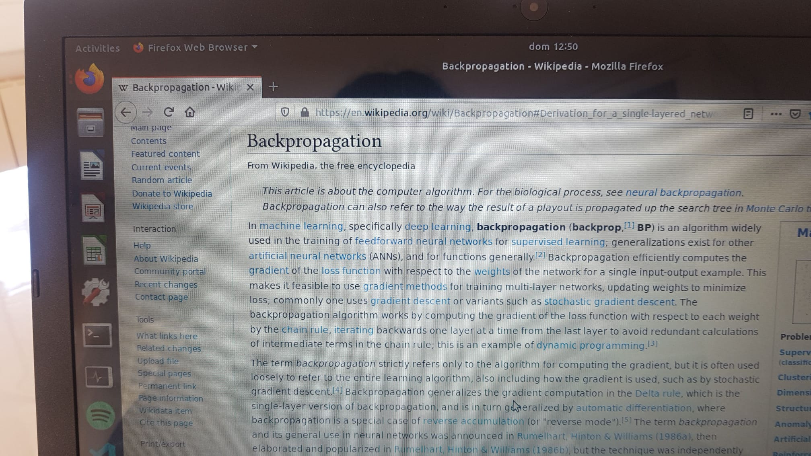

# SyntaxColor
## Tack List
 - [x] Fitxer ```*.txt``` amb 10 mil link a la Wikipedia (com a mínim)
 - [ ] 10 mil fitxers ```*.txt``` amb  el codi html del article (com ```NomDelArticle_X.txt```)
 - [ ] 10 mil fitxers ```*.cvs``` amb _vectr=(paraula,tipus, ... , paraula,tipus)_ (com ```NomDelArticle_Y.cvs```)
## ~~Em queda una estona fins arribar als 10 000~~
|Índex  del concepte|Tots els detalls resumits|
|----------------------------|---------------------------------|
|1.|Wikipedia té que diguem  4 classes de contingut (negreta, blau, fórmules,text normal)|
|2.|Extreure el codi `html`, hi ha mòduls de python que ho parsejen|
|2'.|Mòduls per fer scrapping a wikipedia [wikipedia, re, request,beautiful Soup (*)]|
|3.|X: El text tal qual sense _labels_ (etiquetes) Y:Vector:= (paraula, tipus,...,paraula,tipus)|
|3'.| X:```NomDelArticle_X.txt```, Y:```NomDelArticle_Y.cvs```|
|3''.| Hi ha mòduls de python per fer fitxers ```*.cvs```, _commma separated vaules_|
## --- NoneDateOf
* El que et comentava era algo tipus això, la wikipedia té diguem 4 clases de contingut, en negreta en blau per les referencies, formules i text normal



* Extreure el codi html es senzill i hi han moduls de python que tel parsejen;


~~Bones Adrià, vale ja miraré quin paquet haig de importar per fer-ho. Però aleshores de conjunts {X,Y} com a dataset que faig servir. La Wikipedia mateixa ?~~

* X: El text tal qual, sense labels
  Y: Vector de (Paraula,Tipus, paraula,tipus,paraula,tipus)

* Aleshores agafes dela wikipedia els articles i prepares per cada article (sols text) el seu vector corresponent.

+ ~~Vaja tan fàcil ? (Bé potser a nivell de programar no ho és tant però és clar) I creus que sortirà quelcom útil ?~~

* moduls per fer scrapping a wikipedia: wikipedia, re, reuests i, sobretot, beatutifulSouprequests*

+ ~~I aquestes dades las tindré com dos fitxer o com concretament ?~~

* aixó com vulguis
    el que jo faria és per cada article
    i que clase sigui un nombre per que quedi tot més compacte
    un fitxer amb nom [ARTICLE_X].txt que sigui el text tal qual i un que sigui [ARTICLE_Y].csv
    csv vol dir comma separated values
    y seria basicament: PARAULA, CLASE. PARAULA, CLASE
    moduls per fer scrapping a wikipedia
    aleshores quan facis la xarxa doncs ja tindrás els fitxers amb les dades
    per fer CSVs a python hi ha un módul que es diu CSV pro no et ratllis molt amb això nem fent poc a poc

+ ~~Vale. Entec que farè un programa amb python que fagi tot això de forma automàtica no?~~
* Sep.Python o el que vulguis pro si no es python ni javascript jo em moraria


## 01/12/2019

Estic mirant aquest vídeo [Aquí enllaç](https://youtu.be/ng2o98k983k)

Execute comands in terminal 
```c
pip install beautifulsoup4
//No sè si hi ha alguna vesió superior, s ha instalat bé

pip install lxml
//També s'ha instalat bé (Ni idea que és)

pip install html5lib
//Aquest deu ser actual i obviament una llibreria de html

pip install requests
//No sé que és però aquest també l'ha passat l'Adrià.

// Als 5:20 min comença a explicar una mica que és HTML5 estructura i etiquetes
// Diu que és similar al metalleguatge XML
//S'obren els tag's i es tanquen els tag's
```

3:36 hores

[Stackoverflow](https://stackoverflow.com/questions/52690994/web-scraping-python-writing-to-a-csv)

```python
import requests
import csv
from bs4 import BeautifulSoup as bs

url = requests.get("https://www.top500.org/list/2018/06")
soup = bs(url.content, 'html.parser')

filename = "computerRank10.csv"
csv_writer = csv.writer(open(filename, 'w'))


for tr in soup.find_all("tr"):
    data = []
    # for headers ( entered only once - the first time - )
    for th in tr.find_all("th"):
        data.append(th.text)
    if data:
        print("Inserting headers : {}".format(','.join(data)))
        csv_writer.writerow(data)
        continue

    for td in tr.find_all("td"):
        if td.a:
            data.append(td.a.text.strip())
        else:
            data.append(td.text.strip())
    if data:
        print("Inserting data: {}".format(','.join(data)))
        csv_writer.writerow(data)
```
## 12/12/2019
Finalment la cosa ha sigut bastant més fàcil. Els codis que circulen per stackoverflow han sigut una mala inversió amb, cada vegada un codi més complicat i un munt de ```python expect ``` n'he pogut treure 100, però era molt poc eficient ja que tots els _links_ de Wikipedia (en version) comencen amb ```url  https://en.wikipedia.org/wiki/NomDelArticle``` nomes cal buscar el nom amb el mètode ```pyhton wikipedia.random(1) ```  i després amb```python .replace(" ", "_")``` reemplaça els espais per guions baixos i tenim el nombre del article sense necessitat de  _recomprovar_ la seva existència amb els possible errors

```python
import wikipedia
...
 except wikipedia.exceptions.PageError as eP:
...
 except wikipedia.exceptions.DisambiguationError as eD:
...
```
